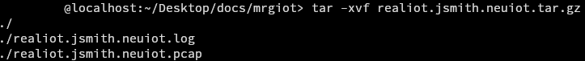

{} Support for IoT Devices is currently in beta, please report
any issues as you encounter them. Additionally, any feedback is greatly appreciated. - NEU IoT Facility {}

# Automated Experiment Creation

{} This guide works only for experiments where
only IoT Devices are being materialized.
{}

{} This guide uses the "mrg-iot" tool to manage device model creation, materialization, reservation, and activation. Additionally, the tool automatically will open camera feeds for devices that support them.
{}

The `mrg-iot` tool can be downloaded using the [mrgiot-download script](https://gitlab.com/-/snippets/4900374/raw/main/mrgiot-download?inline=false), the script will download the latest version of `mrg-iot`. The script can be ran using the following commands:

```sh
chmod +x ./mrgiot-download
./mrgiot-download
```

The script will result in the following:


This creates the `mrgiot/` directory which contains all the files for running the tool and verifying you have all of the requirements. Once run the tool checks for if an update is available, and downloads it if possible. If the tool is up to date then, it checks if there is a virtual environment is present, and creates one and installs all of its requirements if it is not. The tool can be ran using the following command:

```sh
./mrg-iot
```

The tool will provide the following prompt:


Simplfied experiment set up will provide default values for the experiment rather than prompting for them, except for the duration of experiment realization. As an example for the user `jsmith` the default values would be:
```
experiment name: <username> -> jsmith
experiment description: Experiment generated using mrg-iot tool by <username> -> Experiment generated using mrg-iot tool by jsmith
network name: mrg-iot-net
realization name: realiot
xdc name: <username>xdc -> jsmithxdc
```

You will then be prompted for your username and password in order to authenticate you and get resources you have access to:


After logging in, if you are in more than one project, you will be prompted to select what project to create the experiment under. When prompted to select a project from multiple projects you will receive the following prompt:


From your selected project all of the available devices will be presented all with an index number. Such as follows:


You can select devices using both the index and the name listed as an example:


Once you add devices you will be asked if you would like to add more devices to the experiment. After selecting devices, the model will be compiled and pushed to the experiment. If you are not using simplified set up, you will be prompted for an experiment name, experiment description, and network name to be used for the model. 

<details open> 
<summary>Simplified Setup</summary>


</details>

<details> 
<summary>Customized Setup</summary>


</details>

Then you will be prompted for a duration for the realization and the
XDC in an `xw xd xh xm xs` format for specifying the number of weeks, days, hours, minutes, and seconds. As a recommendation, `0w 4d 0h 0m 0s`
is the minimum recommended duration as you begin receive notifications for XDC expiry 3 days before it expires and notifications for realization 
expiration 1 day before it expires.


Once the duration is selected, the experiment is realized then materialized, followed by the creation of the XDC, which the realization attaches to.
If simplified experiment setup is not selected you will be prompted for name for the name of the XDC, otherwise the default value is used.

<details> 
<summary>Customized Setup</summary>


</details>

Once XDC is created, `mrgiot` will wait until the XDC is ready before attaching the realization. Then the experiment will be set up by connecting  and creating ssh tunnels and running setup scripts, which downloads utility scripts and the main client for invoking commands.


If any of the devices have cameras that can be accessed for monitoring, an `ffplay` window will be opened for each camera you have access to. As an example in an experiment using `s-echodot-2` the following camera feed will be opened.


Once the you are done with the experiment, you can type `exit` from within the running spiot-ctl tool in order to end the tool and notify mrg-iot. Which
then prompts you if you would like to download your files from your experiment, the experiment files will be within a tar.gz file that needs to be extracted.


Once the download is complete or is skipped, if simplified experiment setup is selected, then the XDC will be deleted after the realization is detached and relinquished. Otherwise you will be propmted if you would like to delete your XDC. For both forms of set up you will then be propmte for whether you would like to delete the experiment.

<details open> 
<summary>Simplified Setup</summary>


</details>

<details> 
<summary>Customized Setup</summary>


</details>

Once `mrgiot` is closed the archive for the experiment can be extracted and viewd. The file is named based on your enclave id, which is as follows:
```
<realization name>.<experiment name>.<project name>.tar.gz
```

When using simplified set up this defaults to
```
realiot.<username>.<project>.tar.gz
```

As an example user `jsmith` running an experiment on `neuiot` would get the file `realiot.jsmith.neuiot.tar.gz`. To extract the files an `tar -xvf` command can be called, which in the jsmith example would be:

```sh
tar -xvf realiot.jsmith.neuiot.tar.gz
```

Doing this results in the following:



At minimum a log file and pcap file are produced, however based on the commands run more files my be included in the tar.

# Manual Experiment Creation

{}
Experiment creation follows the same systems used for the reservation of other nodes, for documentation
on this system see the "Hello World" 
([Command Line Interface](/docs/experimentation/hello-world),
[Web Interface](/docs/experimentation/hello-world-gui)) documentation for more information.
{}

{}
It is recommended to us FFplay for watching rtsp streams from devices, as users have previously experienced
issues watching streams using VLC
{}

When creating the experiment, in order incorporate IoT devices into the host parameter of a node, and specifying
it is a metal node. As an example, a user wanting to create an experiment with nodes `a`, `b`, and `c` where the 
devices are `s-echodot-1`, `s-echodot-2`, and `s-echopop-1` respectively. In this example where `a` is connected
to `b` which is connected to `c`, which is not connected to `a`. The user would create the following model:

```python
from mergexp import *

# Create a network topology object
net = Network("Example", addressing==ipv4, routing==static)

a = net.node("a", metal==True, host=="s-echodot-1")
b = net.node("b", metal==True, host=="s-echodot-2")
c = net.node("c", metal==True, host=="s-echopop-1")

net.connect([a,b])
net.connect([b,c])

experiment(net)
```

Once the experiment is realized and attached to an XDC, connect to it using the following mrg command:
```sh
mrg xdc ssh <xdc_name>
```

Before starting the experiment, you need to determine the IP address the socket, to do this update apt-get, then download nmap and run a scan, to do this run the following commands
```sh
sudo apt-get update
sudo apt-get install nmap
nmap -sn 172.30.0-254.1 | grep -oE '172\.30\.[0-9]+\.1'
```

This will return the IP address being used by the socket, once this is done, exit the ssh then reconnect and create tunnels for communication with the following command:
```sh
mrg xdc ssh <xdc_name> -L 9000:<IP Address>:9000 
```

This will connect to the XDC while linking to the RTSP restream and file server. Which can be used for
interacting with the experiment while in progress. The following command will download the spiot-client
which is used for direct experiment communication.
```sh
curl https://gitlab.com/-/snippets/4897951/raw/main/spiot_ctl | tr -d '\r' > spiot_ctl; chmod +x ./spiot_ctl
```

Which can then be run:
```sh
./spiot_ctl <IP Address>
```

For accessing the remote stream you can use the data provided by the command line interface:
```sh
ffplay rtsp://localhost:8554/<handler_name>
```

To download experiment files, while linked to the XDC run:
```sh
curl -O -J http://localhost:9000
```

